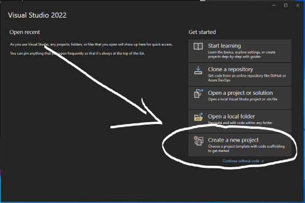
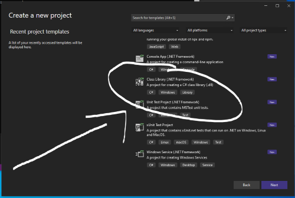
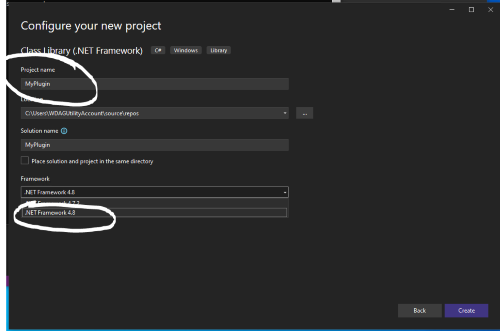
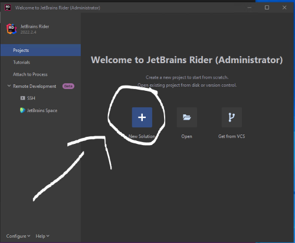
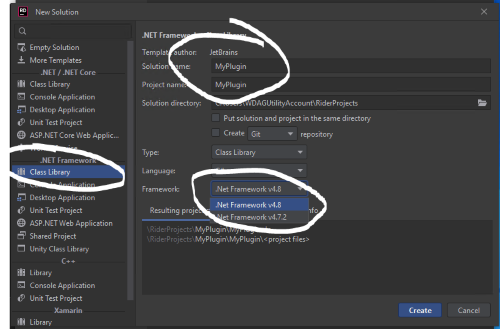
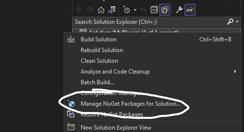
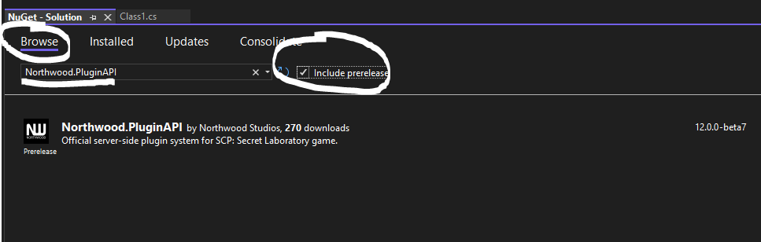
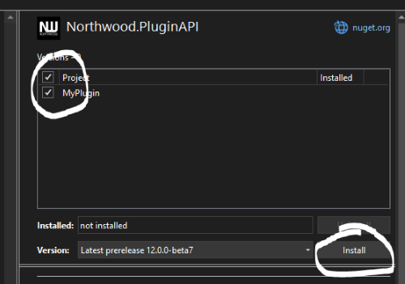
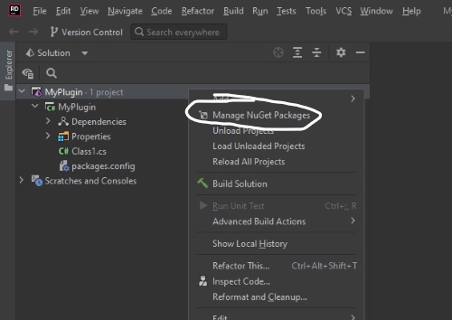
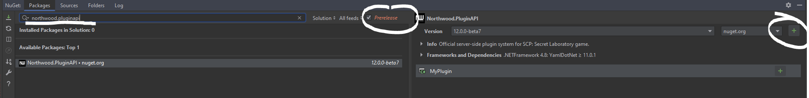

# Setting up your environment
## Prerequisites
- [.NET Framework 4.8](https://dotnet.microsoft.com/en-us/download/dotnet-framework/thank-you/net48-developer-pack-offline-installer)
- An IDE
    - [Visual Studio](https://visualstudio.microsoft.com/downloads/) is a popular choice that is free
        - Make sure to select the .NET desktop development workload
    - [Jetbrains Rider](https://www.jetbrains.com/rider/) is the premium option that is free for students.

## Creating the project
### Visual Studio walkthrough
1. Open Visual Studio
2. Click `Create a new project`  
    

        
View Image

        
    

3. Select `C#` and `Class Library (.NET Framework)`  
    

        
View Image

        
    

4. Click `Next` and select .NET Framework 4.8 from the dropdown, optionally give your plugin a name  
    

        
View Image

        
    

5. Click `Create`

### Rider walkthrough
1. Open Rider
2. Click `New Solution`  
    

        
View Image

        
    

3. Under `.NET Framework` select `Class Library` and make sure framework is set to `v4.8`, optionally specify a solution name  
    

        
View Image

        
    

4. Click `Create`

## Adding References

### Visual Studio walkthrough
1. Right click on your project in the solution explorer and select `Manage NuGet Packages for Solution`  
   *You might need to sign into your Microsoft account on the top right to do this.*  
    

        
View Image

        
    

2. Select the `Browse` tab and search `Northwood.PluginApi`. You currently need to check the `Include prerelease` checkbox to find the latest version  
    

        
View Image

        
    

3. Select it from the list, click on the checkmark next to your project, and click `Install`  
    

        
View Image

        
    

4. Press `OK` or `I Accept` if any prompt(s) shows up.

### Rider walkthrough
1. Right click on your project in the solution explorer and select `Manage NuGet Packages`  
    

        
View Image

        
    

2. Select the `Browse` tab and search `Northwood.PluginApi`. You currently need to check the `Include prerelease` checkbox to find the latest version  
    

        
View Image

        
    

3. Press the green checkmark